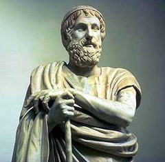
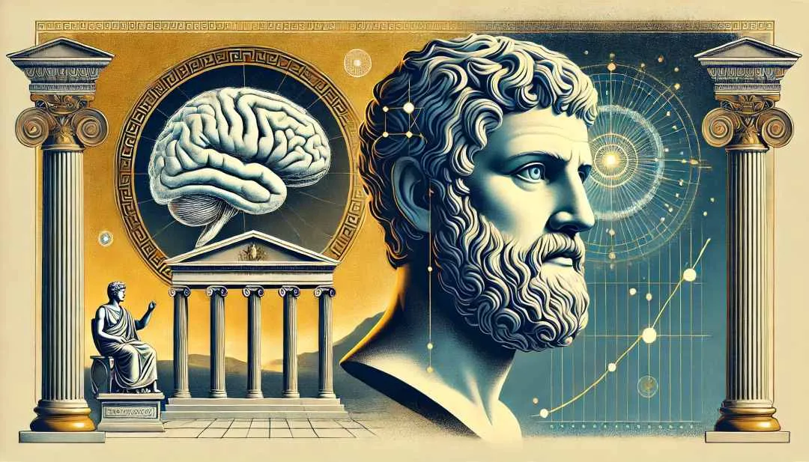
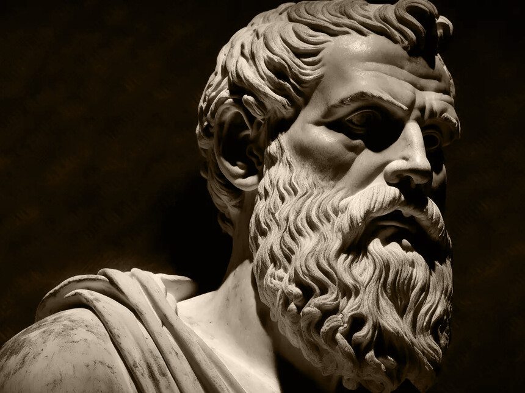

# PARMÉNIDES

https://youtu.be/fB84QppGmWQ?si=vnctfiTRJvW6Mdjc

## TEMAS POR DESCUBRIR
1. Quién fue Parménides
2. El ser como única realidad
3. Crítica a los sentidos
4. Influencia en la filosofía

## 1. Quién fue Parménides

Parménides de Elea fue un filósofo griego presocrático que vivió entre los siglos VI y V a.C. Fundador de la escuela eleática, es considerado uno de los pensadores más influyentes en la historia de la filosofía occidental. Su única obra conocida es un poema filosófico llamado Sobre la naturaleza, del cual solo se conservan fragmentos.

https://es.wikipedia.org/wiki/Parm%C3%A9nides_de_Elea

## 2. El ser como única realidad

La principal tesis de Parménides es que “el ser es y el no-ser no es”. Según él, el ser es eterno, inmutable, indivisible y completo. Niega la posibilidad del cambio, la multiplicidad y el devenir, ya que aceptar que algo puede surgir del no-ser es, para él, un error lógico.

## Vías de conocimiento
1. La vía de la verdad (Aletheia): se llega a la verdad a través de la razón.

2. La vía de la opinión (Doxa), se llega a la verdad a través de los sentidos.

https://www.worldhistory.org/trans/es/1-1030/parmenides/

## 3. Crítica a los sentidos

Parménides diferencia entre dos vías de conocimiento: la vía de la verdad, basada en la razón, y la vía de la opinión, basada en los sentidos. Considera que los sentidos engañan, ya que muestran un mundo cambiante y diverso, mientras que la razón nos lleva al conocimiento del ser, que es único e inmutable.

https://youtu.be/MbDW1836TXg?si=efPWxu0Pqcnq_rbz

## 4. Influencia en la filosofía

La obra de Parménides marcó un antes y un después en la filosofía. Su énfasis en la lógica y la razón influyó profundamente en Platón y en toda la tradición filosófica posterior. Su pensamiento también fue clave para el desarrollo de la metafísica y de la lógica como herramientas del conocimiento.

https://youtu.be/2uh6LHoptzo?si=A_o26dqh8WfLRVR0