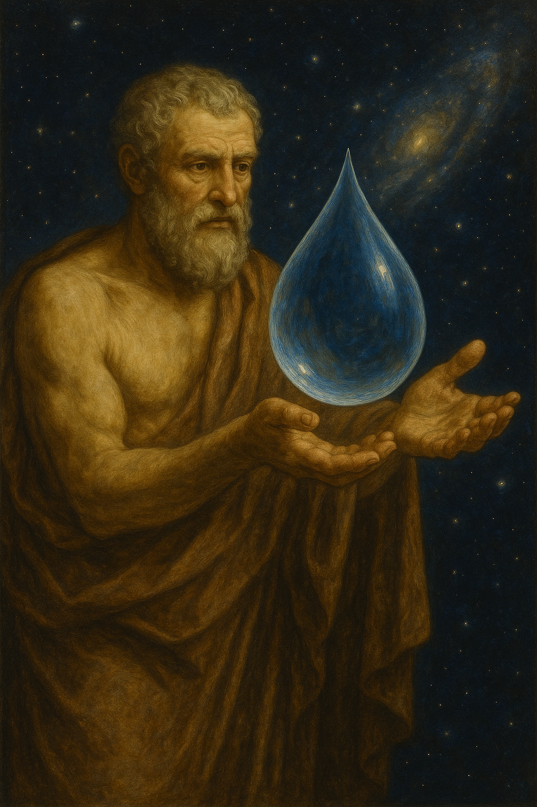

# Tales De Mileto 
## Biografía

  Tales de Mileto (c. 624 - c. 546 a.C.) fue un filósofo presocrático griego considerado el primer filósofo de la tradición occidental. Nació en Mileto, una antigua ciudad griega en la costa de Jonia (actual Turquía). Aunque no se conservan escritos directos de Tales, su pensamiento y sus contribuciones se conocen a través de testimonios de filósofos posteriores como Aristóteles.

  [Video sobre su biografía](https://www.youtube.com/watch?v=72s6NoDLaEg)

)

Su importancia radica en que fue el primero en intentar dar una explicación racional del universo, buscando un principio fundamental (arjé) que subyaciera a todos los fenómenos naturales, en lugar de recurrir a explicaciones mitológicas o religiosas.

# Atribución a la Matemática

### El teorema de Tales
 Si varias rectas paralelas son cortadas por dos transversales, los segmentos que determinan en una de las transversales son proporcionales a los segmentos correspondientes que determinan en la otra transversal.
 
 ### El Teorema del Ángulo Inscrito Recto
  Este teorema establece que cualquier ángulo inscrito en una semicircunferencia es un ángulo recto (de 90 grados). Esto es una consecuencia directa del teorema del ángulo inscrito en general, que también se atribuye a Tales.

[Obras matemáticas mas a detalle](<https://virtual.uptc.edu.co/ova/estadistica/docs/autores/pag/mat/Thales-1.asp.htm#:~:text=Thales%20de%20Mileto%20(624%20a.C.,organizaci%C3%B3n%20racional%20de%20las%20matem%C3%A1ticas.>)

# Su Arjé: El Agua

La principal idea filosófica atribuida a Tales es que el agua es el arjé, el principio o sustancia fundamental de todas las cosas. Aristóteles, en su Metafísica, nos informa sobre esta creencia, sugiriendo algunas posibles razones por las que Tales pudo haber llegado a esta conclusión:

-La humedad es esencial para la vida: Tales observó que el alimento de todas las cosas es húmedo y que la vida depende del agua.

-El agua puede transformarse
 El agua puede existir en diferentes estados: líquido, sólido (hielo) y gaseoso (vapor), lo que podría sugerir su capacidad para adoptar diversas formas.

-La tierra flota sobre el agua: Aunque esta idea pueda parecer primitiva hoy en día, algunos testimonios indican que Tales creía que la Tierra era un disco plano que flotaba sobre una extensión de agua.

[definicion de arjé](https://es.wikipedia.org/wiki/Arch%C3%A9)

# Otras Ideas y Aportaciones

Tales de Mileto es reconocido por varias contribuciones clave:

-Hilozoísmo: Se le atribuye la creencia de que la materia tiene vida o una fuerza vital inherente, ejemplificado por su idea de que el imán tiene alma por mover el hierro.

-Fundador de la Escuela de Mileto: Inició esta escuela filosófica, a la que pertenecieron Anaximandro y Anaxímenes, marcando el comienzo de la filosofía occidental y la búsqueda racional del arjé.

-Ruptura con el Pensamiento Mítico: Su mayor logro fue intentar explicar el mundo a través de la observación y la razón, alejándose de las explicaciones mitológicas y religiosas hacia una indagación filosófica de la naturaleza.

[Tales y mas filosofos importantes](https://www.britannica.com/topic/Greek-philosophy/The-seminal-thinkers-of-Greek-philosophy)

[video sobre la Escuela de Mileto](https://www.youtube.com/watch?v=XpcA1Cw-qwQ)
